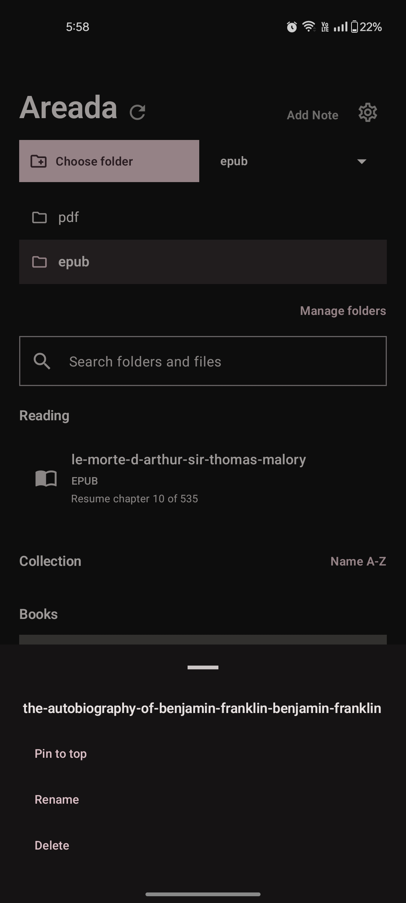
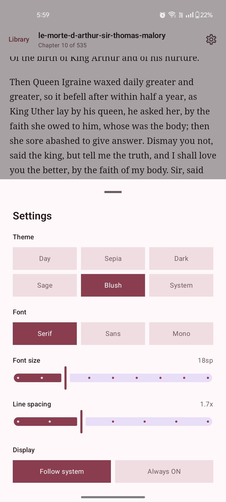

# Areada

Areada is a minimal offline Android reader focused on lightweight local reading.

It supports EPUB, TXT, and PDF files, with a clean monochrome interface, local library access, saved reading progress, and basic plain-text note support.

## Supported Formats

- EPUB
- TXT
- PDF

## Features

- Clean Jetpack Compose UI
- Minimal monochrome visual theme
- EPUB, TXT, and PDF file support
- Basic local note support using plain `.txt` files
- Storage Access Framework folder picker so users choose exactly which folders are visible
- Recent documents shelf stored locally
- Saved reading progress so reopened files resume where you left off
- Reader settings for theme, font family, and font size
- EPUB extraction and chapter rendering without a heavy external reader SDK
- Pinch-to-zoom reading for EPUB and PDF
- PDF rendering through Android's built-in `PdfRenderer`
- Offline-only reading
- No internet permission
- No device-wide automatic scanning
- No ads
- No analytics
- No tracking

## Privacy

Areada is designed to work fully offline.

The app does not collect, upload, sell, or share user data. Files opened in the app remain on the user's device. The app does not require internet permission.

## Screenshots

| Library | Reader | Settings | Notes |
|---|---|---|---|
|  |  |  |  |

## Package Name

```txt
app.areada